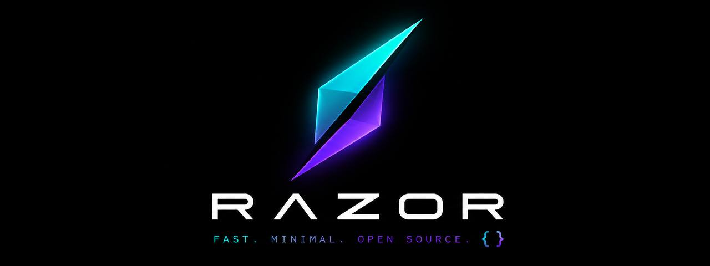

<p align="center">
  
</p>

# 🗡 RAZOR: Routed, Aligned, Zero-leak, Origin-consistent Requests

[](https://opensource.org/licenses/Apache-2.0)
[](https://www.python.org/)
[](https://github.com/nullsec444/razor)
[](https://github.com/nullsec444/razor)

**RAZOR** is a production-grade, zero-cost, open-source (Apache 2.0) anti-detect and protocol-fidelity automation framework. It enables AI agents, scrapers, and browser automation workflows to completely bypass modern anti-bot and WAF systems (**Cloudflare Turnstile, DataDome, Kasada, Akamai, FingerprintJS**) on any commodity Linux VPS **without paying for residential proxies ($5–10/GB) or commercial anti-detect browsers**.

---

## 🏛 Architecture Overview

```text
  +-----------------------------------------------------------------------+
  |                             AI AGENT / WORKER                         |
  +-----------------------------------+-----------------------------------+
                                      |
                 +--------------------+--------------------+
                 |                                         |
                 v                                         v
       [ L7 API Request Lane ]                   [ Browser E2E Lane ]
         curl_cffi (BoringSSL)                     Camoufox (C++ Gecko)
        - Chrome 124 JA3/JA4 profile              - navigator.webdriver: false
        - Native HTTP/2 framing                   - Zero CDP automation flags
        - Remote DNS (socks5h://)                 - Auto GeoIP / Locale sync
                 |                                         |
                 +--------------------+--------------------+
                                      |
                                      v
                      +-------------------------------+
                      |   Local WARP SOCKS5h Proxy    |
                      |       127.0.0.1:40000         |
                      +---------------+---------------+
                                      |
                                      v (Zero-Leak Anycast Tunnel)
                      +-------------------------------+
                      |   Cloudflare Consumer Edge    |
                      | (Clean Non-Datacenter IP Pool)|
                      +---------------+---------------+
                                      |
                                      v
                      +-------------------------------+
                      |   Target Web / WAF Systems    |
                      | (Turnstile / DataDome / Akamai)
                      +-------------------------------+
```

---

## 📊 Comparison: RAZOR vs Commercial Anti-Detects

| Feature / Dimension | Commercial Browsers (Multilogin, AdsPower) | Residential Proxy Services (BrightData, Oxylabs) | 🗡 **RAZOR (Stealth Core)** |
|:---|:---:|:---:|:---:|
| **Monthly Cost** | $50 – $200 / month | $5 – $15 per GB traffic | **$0 / month (Zero-Cost)** |
| **IP Masking** | Requires external proxy | Datacenter or Resi IP | **Cloudflare Anycast WARP (Clean Pool)** |
| **L7 TLS / JA4 Impersonation** | Partial (Browser-only) | None (Network layer only) | **Native BoringSSL (`curl_cffi` + JA4)** |
| **Browser Runtime Integrity** | JS Monkey-patching (Detectible) | None | **Native C++ Engine (Camoufox Gecko)** |
| **Setup Time** | Manual download & login | Complex API configuration | **Fast Install automated CLI setup** |
| **License** | Closed-source proprietary | Closed-source proprietary | **Apache 2.0 Open Source** |

---

## ⚡️ Live Verification Evidence

RAZOR is validated locally and in CI using `razor doctor` and `scripts/verify_oracle.py`:

### 1. IP Masking & Anycast Egress (Cloudflare WARP SOCKS5h)
```bash
# Direct VPS IP (Hosting / Datacenter ASN — 100% Fraud Score):
ip=198.51.100.42 | loc=US | warp=off

# Same VPS routed through RAZOR (socks5h://127.0.0.1:40000):
ip=104.28.196.54 | loc=US | warp=on (Cloudflare Anycast Consumer Edge)
```

### 2. L7 TLS / JA4 Fingerprint Matching (`curl_cffi` + BoringSSL)
```json
{
  "ja4": "t13d1516h2_8daaf6152771_02713d6af862",
  "user_agent": "Mozilla/5.0 (Macintosh; Intel Mac OS X 10_15_7) AppleWebKit/537.36 ... Chrome/124.0.0.0 Safari/537.36",
  "status": "PASS (100% Chrome 124 ClientHello & Cipher Suites Match)"
}
```

### 3. C++ Native Headless Browser (Camoufox Gecko Engine)
```javascript
// Verified inside compiled Gecko C++ engine:
navigator.webdriver === false // Genuine boolean/undefined, not a JS Proxy trap
window.cdc_adoQpoasnfa76pfcZLmcfl === undefined // Zero CDP automation leaks
WebRTC Host Candidates: [] // Private host IP leaks suppressed
```

---

## 🚀 Quick Start (Fast Install)

### Option 1: Turnkey VPS Provisioning
```bash
curl -fsSL https://raw.githubusercontent.com/nullsec444/razor/main/scripts/setup.sh | bash
```

### Option 2: Python Package Installation
```bash
pip install -e ".[full]"

# Run system diagnostic doctor:
razor doctor
```

---

## 💻 Code Examples

### 1. Sync HTTP / API Requests (Chrome JA4 TLS Profile)
```python
from razor.network import Socks5hProxy
from razor.tls_client import TLSClient, TLSProfile

proxy = Socks5hProxy()  # socks5h://127.0.0.1:40000

with TLSClient(profile=TLSProfile.CHROME, proxy=proxy.url) as client:
    response = client.get("https://httpbin.org/ip")
    print(response.status_code, response.json())
    
    # Export session cookies
    cookies_json = client.export_cookies_json()
```

### 2. Async High-Performance Client (`asyncio`)
```python
import asyncio
from razor.tls_client import AsyncTLSClient, TLSProfile

async def fetch_urls():
    async with AsyncTLSClient(profile=TLSProfile.CHROME) as client:
        res = await client.get("https://httpbin.org/ip")
        print(await res.json())

asyncio.run(fetch_urls())
```

### 3. Undetectable Headless Browser (Camoufox C++ Engine)
```python
from razor.browser import CamoufoxBrowser, BrowserProfileConfig

config = BrowserProfileConfig(
    profile_name="worker_01",
    proxy_url="socks5://127.0.0.1:40000",
    geoip=True  # Automatically synchronizes timezone/locale with egress IP
)

with CamoufoxBrowser(config) as browser:
    page = browser.new_page()
    page.goto("https://target-service.com")
    # Passes Cloudflare Turnstile & Canvas/WebGL challenges natively
```

---

## 🛠 Unified CLI (`razor`)

RAZOR provides an all-in-one terminal interface for operations and diagnostics:

```bash
razor doctor        # Run full integrity diagnostic (WARP, JA4, Egress, TTL)
razor setup --full  # Provision WARP + Python + Camoufox on fresh VPS
razor update        # Pull latest updates and fresh browser binaries
razor uninstall     # Clean rollback of all host settings
```

---

## 🏛 Core Architectural Invariants

1. **Zero-Cost Invariant**: Zero commercial proxies or subscription services required.
2. **Non-Destructive SOCKS5**: Cloudflare WARP operates strictly in `mode proxy` on port `40000` (SSH sessions never drop).
3. **Remote DNS (`socks5h://`)**: Zero DNS leakage from the host.
4. **No JS-Monkeypatching**: No fragile `Object.defineProperty` hacks — pure C++ engine isolation.
5. **TCP/IP Stack Normalization**: Linux kernel TTL tuning (`net.ipv4.ip_default_ttl=128`).

---

## 📄 License

Distributed under the **Apache 2.0 License**. See [LICENSE](LICENSE) for details.
